# edge_detection_ros_cpp
An edge detection module with a ros server and callbacks

# Instructions:

1. Create a catkin workspace, with an `src` directory, and clone this repository inside src. (Also copy the `robot` package as well, not included here in the repo.)
2. Build a docker image from the `Dockerfile` in `scripts` directory.
3. Docker run command used:

```
docker run -it --net=host --gpus all --privileged=true --rm    --env="NVIDIA_DRIVER_CAPABILITIES=all"     --env="DISPLAY"     --env="QT_X11_NO_MITSHM=1"   --volume="/tmp/.X11-unix:/tmp/.X11-unix:rw"  --volume=$(pwd):/src   ros_noetic_opencv:v1     bash
```
4. Run `catkin build`

## To run on a directory of images.

Run the following in different terminals from catkin_ws. Make sure to source the devel in each terminal!
```
roscore
rosrun edge_detection edge_detection_service
rosrun edge_detection edge_detection_service_client
```
(Adjust the directory inside `src/edge_detection_service_client.cpp`)

## To run on live data from rosbags or live ROS feed.
Run the following in different terminals from catkin_ws. Make sure to source the devel in each terminal!
```
roscore
rosrun edge_detection edge_detection_service
rosrun edge_detection edge_detection_node
rosrun rviz rviz -d src/edge_detection_ros_cpp/data/config_file.rviz
rosbag play ...
```
(Adjust the topics inside `src/edge_detection_node.cpp` in the constructor all the way on top!)


# Edge detector library:

### Relevant files:
1. `EdgeDetector.cpp` and `EdgeDetector.hpp`.

A simple canny edge detector from Opencv has been used to threshold the image and obtain good edges in an image, using appropriate threshold values. After a binary image is obtained, we use one of the following two:
1. Contour detection: Contours are obtained from the canny detector, using cv::findcontours and each contour typically has the edges of a square.
2. Hough lines transform. Hough lines are found using cv::HoughLines, and are plotted.

Outputs:

### From hough lines transform

1. 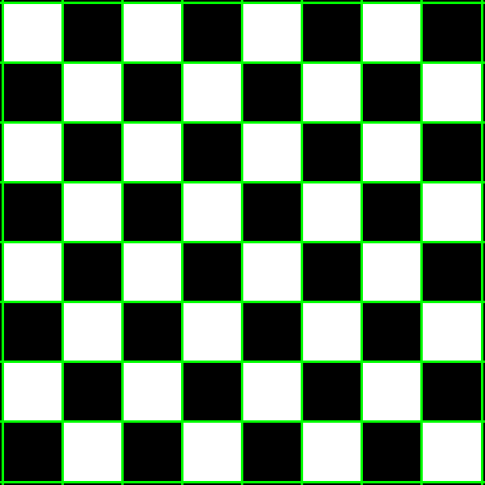
2. 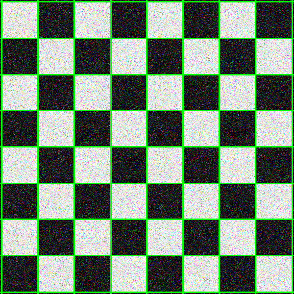
3. 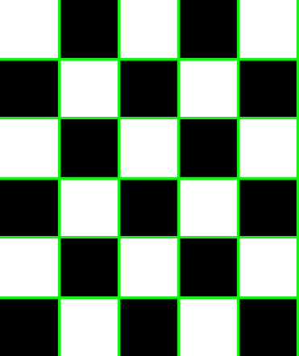
4. 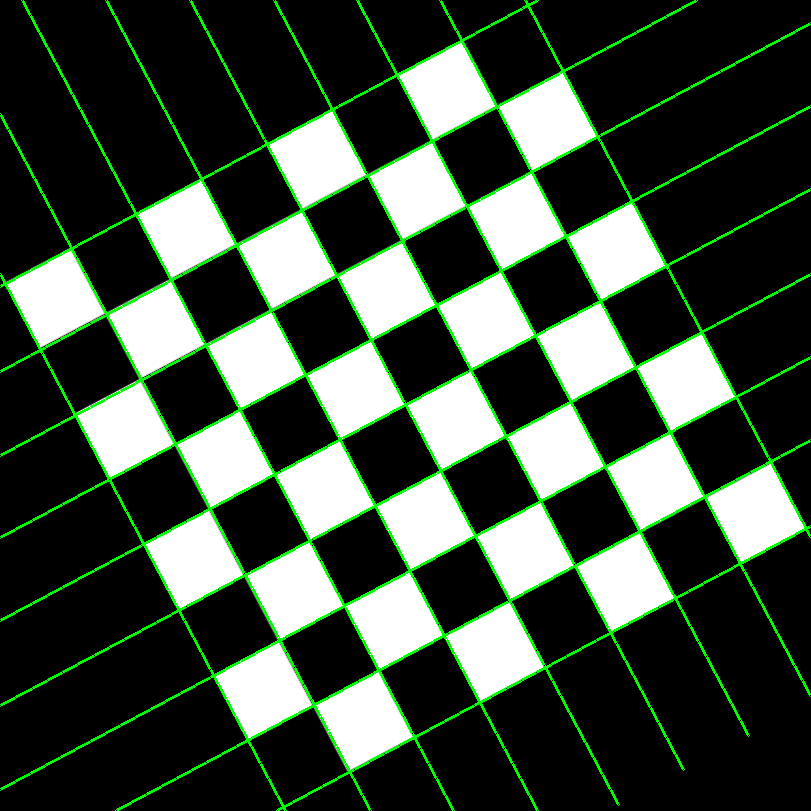
5. 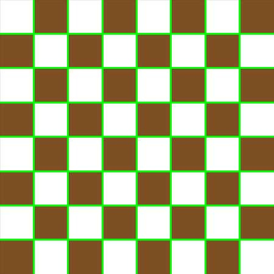

### From Contour transform

1. 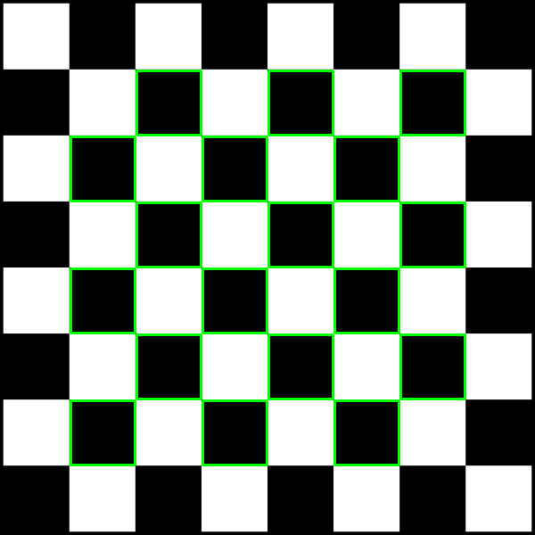
2. 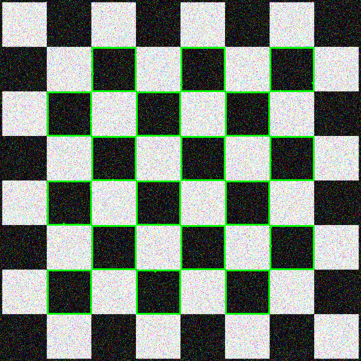
3. 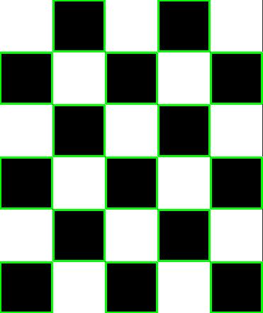
4. 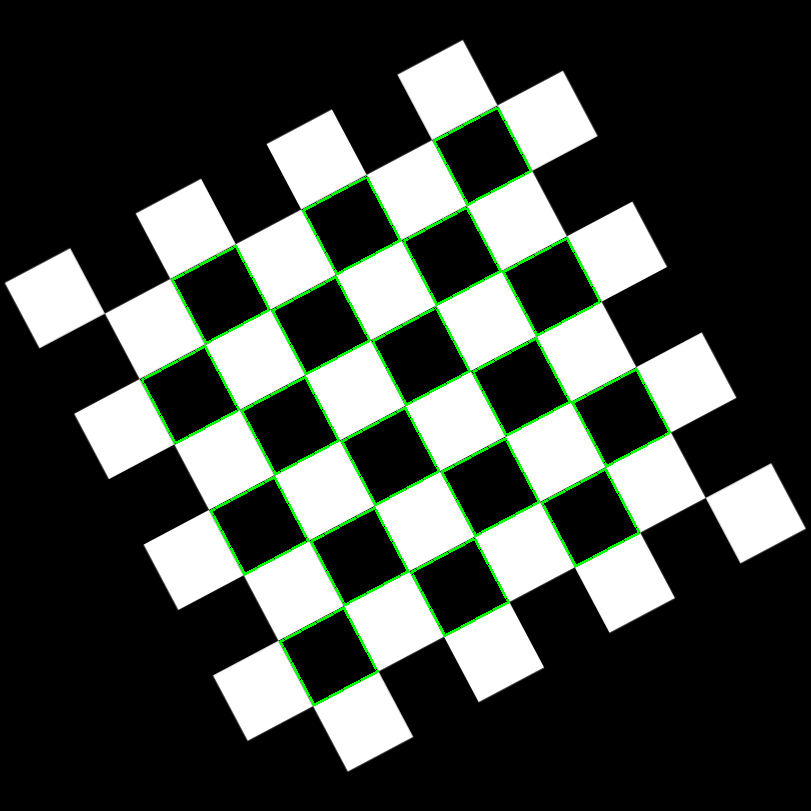
5. 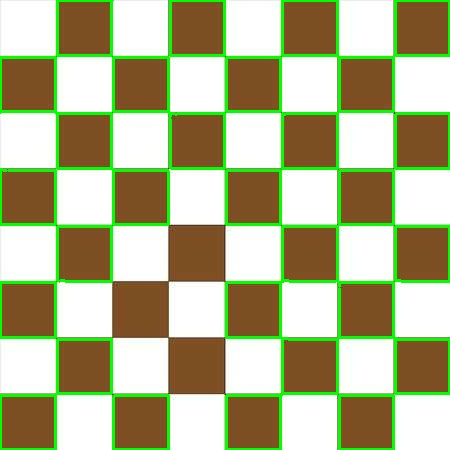

### Observations:
Although contour seems to look better, it tends to miss some of the internal squares, and it does not have any notion of straight lines, while hough lines transform can provide geometrically consistent lines, which are more useful in some tasks. With more tuning, perhaps the performance can be improved. The image is first blurred and morphological operations are first performed to highlight the corners better.

The library has been build using catkin and Cmake.


# ROS Service

Relevant files are : 
1. edge_detection_service.cpp
2. edge_detection_service.h
3. edge_detection_service_client.cpp


A custom message that can hold both the output edges image, and the 2d locations of the pixels has been created, named `Edges.msg` (of Image and Point[]).
A ROS service exposes the library functionality has been created as `DetectEdges.srv`. It takes in a `sensor_msgs::Image` RGB image and finds the edges and returns a response of type `Edges.msg`. In the service callback, sensor message to Opencv and vice-versa conversions are performed. The `edge_detection_service_client.cpp` is an example on using the service, which reads images from a directory and performs edge detections. 

Adjust the directory name in `src/edge_detection_service_client.cpp`

# ROS Callback node

Relevant files
1. edge_detection_node.cpp
2. edge_detection_node.h

A pub-sub has been implemented to interface with live data/ bagfiles. A subscriber subscribes to both color and depth images. A time synchronizer has been used to sync the two messages. Edge detection is performed on the RGB images and the edges are returned. The output edges image is also published onto a topic `edges_image` of type `sensor_msgs::Image` and can be viewed on Rviz.

Example output presented here.

1. 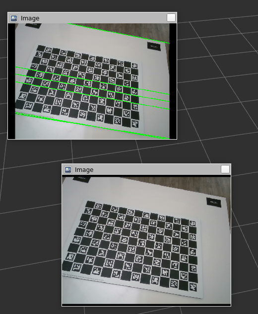
2. 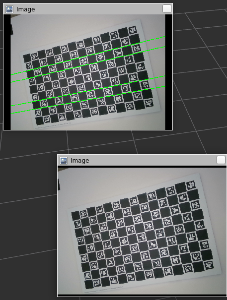


Then, the depth image is converted to an OpenCV format image. The 2D edge pixels returned are combined with the depth image to "reproject" the images back to 3D using a pinhole camera model. Thus, another subscriber subscribes to the cameraInfo topic to continuously update the camera intrinsics matrix, K (maybe not the best design choice). These 3D points then are converted to `pcl::pointcloud` and then `sensor_msgs::Pointcloud2`, and the pointcloud is published onto `edge_points` topic.


The performance is not great, and it is not easy to say why. Looks like using the depth image to convert to 3D points might be the issue. 
Example output presented here.


# ROS markers visualization
The 3D points are then sent to a `place_markers` function within the same files to create a marker with the given position, and `root_link` as frame_id. (Not sure if this is the right one, as the results seem poor). They are then pushed to a marker array and published as a viz_marker onto the topic `viz_marker_array`, as green markers. The results are quite poor again, and it is because of the previous issue. 

Take a look at `output/all_combined.flv` for the full performance (part 4)
